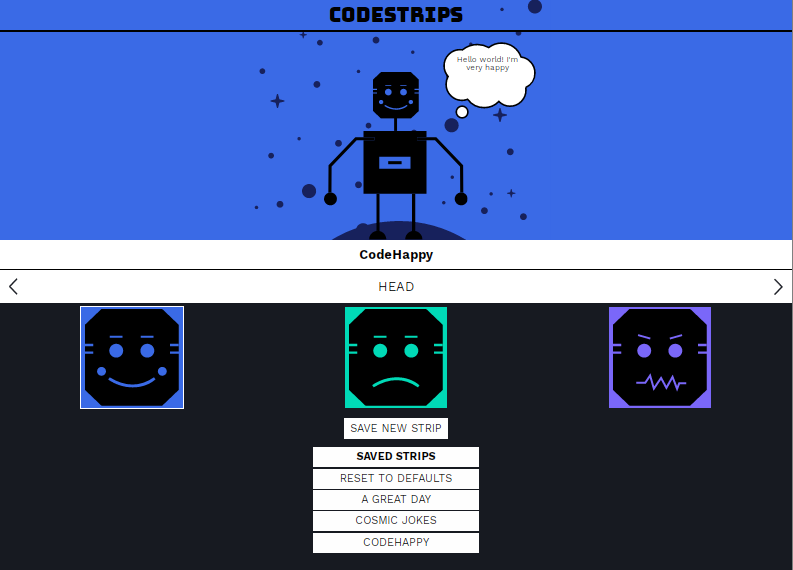

# codestrips-app

Let’s build an API for Codestrips! Codestrips is a small application to allow users to create and save small one-pane comic strips. You can select a head, body, background location, thought/speech bubble type, thought/speech bubble text, and caption for a strip. By the end of this project, you’ll be able to save these to a SQLite database and retrieve them so that they persist even when you restart your server.

Preview 



## Setup

Download the project

```sh
git clone https://github.com/StyvenSoft/codestrips-app.git
```

Navigate folder
```sh
cd codestrips-app
```
Open Project
```sh
code .
```

Install dependencies
```sh
npm install
```
Tests
```sh
npm test
```

Run
```sh
npm start
```
Server in listen on http://localhost:4001